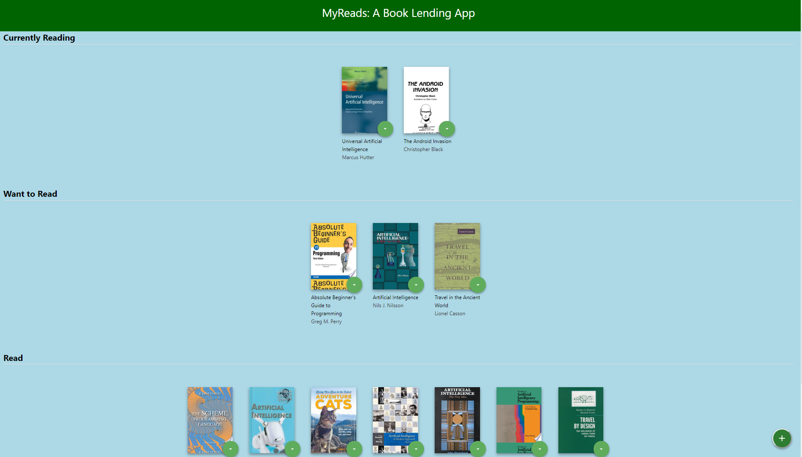
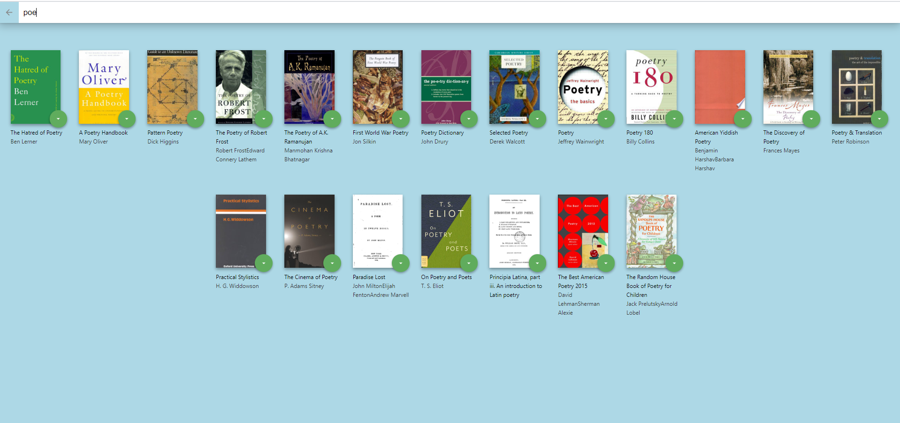

### MyReads A Book Lending App

## Project Purpose

This Application is built for my Udacity Nanodegree Program. The purpose of this porject is to demonstrate understanding of the basic structure and operation of a React based App.

This project was bootstrapped with [Create React App](https://github.com/facebook/create-react-app).

## How to Run the App Locally

You can clone the App using the below link.

`git clone git@github.com:naima-shk/Book-Tracking-App.git`

In the project directory, you can run:

`npm install` OR `Yarn install`

then run

`yarn start` OR `npm start`

Open [http://localhost:3000] to view it in the browser.

